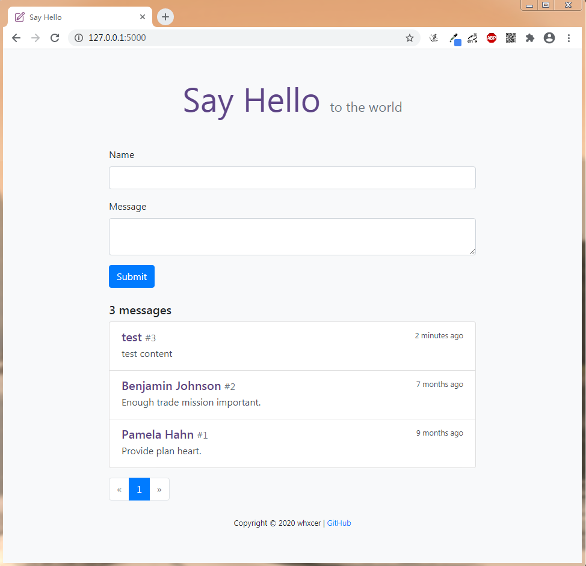

# SayHello

使用 Flask 完成的留言板功能


## 项目截图

主页:




## 项目功能
- 在留言板留言
- 查看其他人的留言


## 项目运行
```bash
# 克隆项目
$ git clone https://github.com/wtraceback/SayHello.git
# 切换至目录
$ cd SayHello
# 安装虚拟环境
$ python -m venv venv
# 启动虚拟环境
$ venv\Scripts\activate
# 安装依赖
$ pip install -r requirements.txt
# 生成虚拟数据
$ flask forge
# 运行项目
$ flask run
* Running on http://127.0.0.1:5000/
```


### 命令行
自定义命令:
- 生成虚拟数据: `flask forge`
